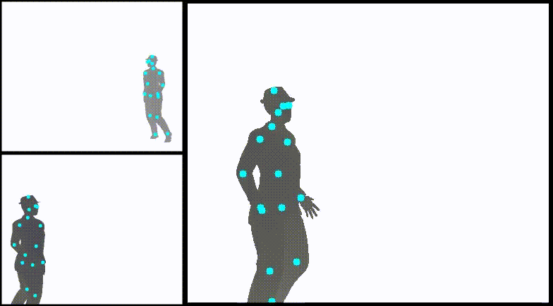
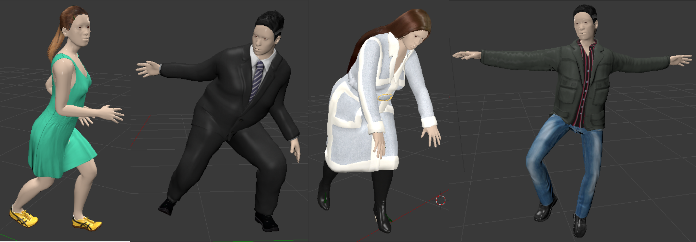
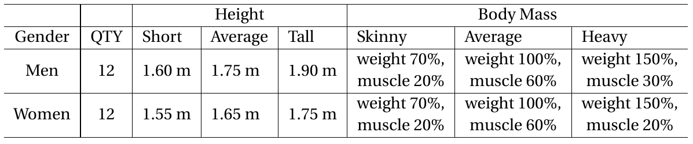

# **DepthHuman: A tool for depth image synthesis for human pose estimation**




Obtaining data with annotations to train models for 2D and 3D human pose estimation can be very overwhelming. A good way to obtain large quantities of such data and annotations is to use computer graphics and synthesize images. By synthesizing images with people we have the benefit that 2D and 3D body landmark annotations are extracted automatically during the rendering process. This project proposes a solution tool for synthesizing large quantities of depth images with annotations for depth-based human pose estimation from frontal profiles. It uses Blender python API to run an automatized pipeline for image synthesis and motion simulation using motion capture (mocap) sequences and 3D human characters created with the Makehuman software.

We have created the [DIH dataset](https://www.idiap.ch/en/dataset/dih) a large scale dataset of synthetic depth images with annotations for depth-based 2D pose estimation with this tool.

## **Requirements**

* numpy
* opencv
* scipy
* libtiff (to convert to uint16 images)
* Blender 2.7x
* Makehuman retargeting addons for Blender

The project currently should run on **Blender >=2.78** API (though only tested on 2.7x versions). To install blender please follow the instruction in the [official website](https://docs.blender.org/manual/en/dev/getting_started/installing/index.html).

We provide Human3D characters with different body features created with **Makehuman**. If you wish to create your own 3D rigged characters you can install the software. Currently, Makehuman has its own ppa for a straightforward installation on _Ubuntu_. Or you can download it from the [official website](http://www.makehumancommunity.org/)

## **Human 3D character collection**



We have created a collection of 24 human characters, 12 men and 12 women, with Makehuman. The characters exhibit different body features such as height and weight. Furthermore, the characters are dressed with different outfits to increment their body shape. Note that the variability in their outfit colors is very limited which is irrelevant since depth images are invariante to texture and color. The table below shows the different Makehuman properties values when created the models. The models can be found under `DressedModels` folder.



## **Motion capture data**

We use the CMU-Mocap sequences dataset fo motion simulation. The rigged skeletons created with Makehuman are optimized for sequences in this dataset. You can find the motion keyframes in the [official website](https://sites.google.com/a/cgspeed.com/cgspeed/motion-capture/cmu-bvh-conversion).

## **Rendering pipeline and annotations**

In a nutshell, the rendering process for synthesizing images with annotations consist on the following steps

1. Load 3D characters and retarget mocap sequences. 
2. 3D characters are always kept inside the field of view of cameras.
3. Random orientations are applied to the characters during motion simulation.
4. Three virtual cameras are placed randomly in a range of 8m radius from the character.
5. Images and annotations are generated for each of the virtual cameras.

Depth images are generated by rendering the depth buffer and annotations are obtained from the rigged skeletons locations in the scene. The following are the assets and annotations that we provide support for

* Synthetic depth images of up to two 3D characters.
* Body landmark 3D and 2D coordinates for each of the 32 bones in CMU-Mocap dataset.
* Binary and colored (material) masks.


## **Environment setup**

Motion simulation features of Makehuman have to be enabled inside blender.

1. Download the blender_plugins_for_1.1.1.zip from the [release site](https://download.tuxfamily.org/makehuman/releases/1.1.1/).
2. Decompress the zip file and copy the _makeclothes, maketarget and makewalk_ folders into your local path ``/home/youruser/.config/blender/2.7x/scripts/addons/``, Blender will automatically look for available addons in this path.
3. There are some issues at importing models with armatures (skeletons) created in **Makehuman** into blender. The less troublesome model format is mhx2, but is contained in a different repository. [Download the zip](https://bitbucket.org/Diffeomorphic/mhx2-makehuman-exchange). Follow the intructions in the website for installation.
4. Open a blender GUI and go to: user preferences ->_the Addons_ tab and activate the boxes for all the Makehuman addons, namely: _Makehuman Exchange 2 (mhx2)_, _Makewalk_, _Makeclothes_ and _Maketarget_. 
5. In blender GUI, move to: user preferences-> _the File tab_ and activate the "_Auto Run Python Scripts_" box.


## **Using the tool**

Configuration parameters are setup via the files in folder `ConfigFiles`. Parameters such as number of models, distances to camera, etc are specified in `ConfigFiles/scene_parameters.json`. Absolute paths to mocap dataset, 3D human characters, a list of selected mocap sequences and output path should be provided in `ConfigFiles/main_config.xml`. Finally, parameters of the camera to be used such as f number, sensor size, etc, are provided in `ConfigFiles/rec_manager_config.xml`.

The rendering pipeline is executed inside `src/py` with

```
blender --background --python mainHorizontalViews.py

```

## **Citation**

If you happen to use the models and code for your research please cite the following papers


```
@INPROCEEDINGS{Martinez_IROS_2018,
author={Mart\'inez-Gonz\'alez, Angel and Villamizar, Michael and Can{\'e}vet, Olivier and Odobez, Jean-Marc},
booktitle={2018 IEEE/RSJ International Conference on Intelligent Robots and Systems (IROS)},
title={Real-time Convolutional Networks for Depth-based Human Pose Estimation},
year={2018},
pages={41-47},
doi={10.1109/IROS.2018.8593383},
ISSN={2153-0866},
month={Oct},
}

@ARTICLE{Martinez_TCSVT_2019,
author={Angel {Martínez-González} and Michael {Villamizar} and Olivier {Canévet} and Jean-Marc {Odobez}},
journal={IEEE Transactions on Circuits and Systems for Video Technology},
title={Efficient Convolutional Neural Networks for Depth-Based Multi-Person Pose Estimation},
year={2020},
doi={10.1109/TCSVT.2019.2952779},
}

```


